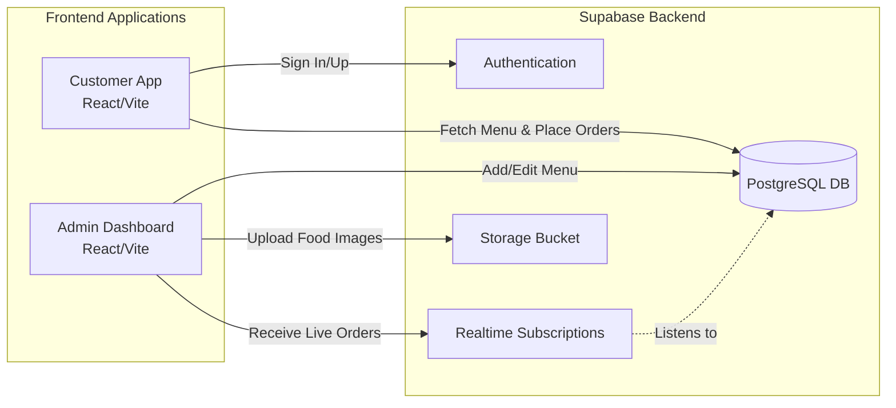

# UrbanEats

UrbanEats is a modern, full-stack food delivery platform with two connected applications: a Customer-facing App for browsing and ordering food, and an Admin Dashboard for managing orders and the restaurant menu in real-time.

Both applications are built with React (Vite) and use Supabase for Authentication, Database, and Storage.

## 🏗️ System Architecture



## 🚀 Features

### Customer App (`UrbanEats/`)
- **Authentication**: Secure Google OAuth and Email/Password login.
- **Dynamic Menu**: Real-time menu fetched from the database.
- **Cart System**: Local state management for adding/removing items from the cart.
- **Checkout & Ordering**: Streamlined checkout process that syncs directly with the admin dashboard.

### Admin Dashboard (`adminpanel/`)
- **Real-Time Orders**: Live feed of incoming orders using Supabase Realtime subscriptions.
- **Menu Management**: Easily add, edit, or remove items from the global menu.
- **Image Uploading**: Drag and drop food images that are automatically uploaded to Supabase Storage.
- **Order Processing**: Update order statuses (Preparing, Out for Delivery, Delivered).

## 🛠️ Tech Stack
- **Frontend**: React.js, Vite, Bootstrap, CSS
- **Backend/BaaS**: Supabase (PostgreSQL Database, Auth, Storage)
- **Deployment**: Vercel

## 💻 Getting Started Locally

### 1. Clone the repository
```bash
git clone https://github.com/prxjay/UrbanEats.git
cd UrbanEats
```

### 2. Install Dependencies
You need to install dependencies for **both** applications.
```bash
# Install Customer App dependencies
cd UrbanEats
npm install

# Install Admin Panel dependencies
cd ../adminpanel
npm install
```

### 3. Setup Environment Variables
Create a `.env` file in both `UrbanEats/` and `adminpanel/` directories containing your Supabase project keys:
```env
VITE_SUPABASE_URL=your_supabase_url
VITE_SUPABASE_ANON_KEY=your_supabase_anon_key
```

### 4. Run the Development Servers
Open two terminal windows.
```bash
# Terminal 1: Start Customer App (Port 5173)
cd UrbanEats
npm run dev

# Terminal 2: Start Admin Panel (Port 5174)
cd adminpanel
npm run dev
```

## 📜 License
This project is open-source and available under the MIT License. Feel free to use, modify, and distribute the code!
